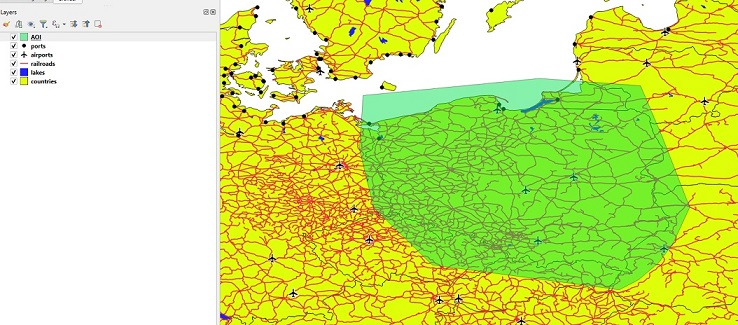
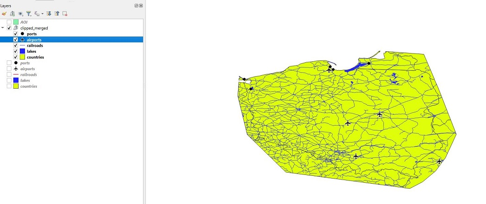
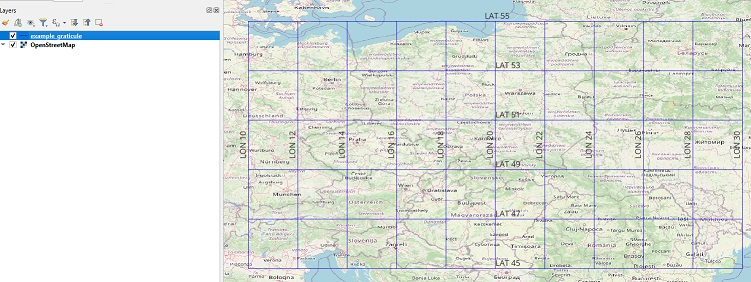

# gis_misc

Miscellaneous scripts/tools that involves spatial data processing

- [Scripts](#scripts)
  - [airspace_geometry](#airspace_geometry)
  - [clip_and_merge](#clip_and_merge)
  - [faa_dof_to_postgis](#faa_dof_to_postgis)
  - [graticule_generator](#graticule_geneator)
  - [landsat_gcp](#landsat_gcp)
  - [polygons_from_csv](#polygon_from_csv)

# Scripts <a name=scripts>

## airspace_geometry <a name=airspace_geometry>

Functions to easily create airspace geometries based on airspace definitions that is used in aeronautical publications,
example:
 * circle with given center point  and radius
 * circular sector with given center point, beginning and end azimuth
 * ring, with given center point and two radii

[Jupyter notebook](airspace_geometry/usage_examples.ipynb) with usage examples 

## clip_and_merge <a name=clip_and_merge>

Clip data from multiple files to given area of interest and save result into one GeoPackage (gpkg) file
Each layer in the result gpkg is clipped input file.

Notes: 
 - Script takes no input/output parameters
 - input parameters are taken from configuration file:
   - name: `config.yml`
   - must be in the 'current' directory (dir from which command to execute script is called)
 - input files: directory to the input files is taken from configuration file
 - area of interest to which data will be clipped:
   - taken from configuration file
   - formatL WKT (Well Known Text)
 - output file: file/path is taken from configuration file

Usage:
```
python clip_and_merge
```

Example usage:

Input directory structure with files:

```
data
    │   countries.gpkg
    │   lakes.geojson
    │   railroads.shp
    ├───airports
    │       airports.shp
    └───ports
            ports.shp
```

Input:


Output:


## faa_dof_to_postgis <a name=faa_dof_to_postgis>

Script to load FAA (Federal Aviation Administration) DOF (Digital Obstacle File) data from CSV 
file into PostgreSQL/PostGIS database.

> Notes:
> * scripts takes no parameters
> * it reads configuration file `faa_dof_to_postgis_config.yaml` which is in the same directory as script
> * it reads data from `DOF.CSV` file which is in the same directory as script

Usage:

```
python faa_dof_to_postgis.py
```

## graticule_generator <a name=graticule_geneator>

Script to generate graticule (parallels, meridians) for specified extend (west-east, south-north) and intervals.
Output layer can be added to the map to create 'smooth' graticule layer.

Usage:

```
python graticule_generator.py [-h]
                              -c/-config-file CONFIG_FILE
                              -o/--output-file OUTPUT_FILE

```
**-h, --help**  
display help

**-c, --config-file**  
configuration file path

**-o, --output-file**  
output file path, file format supported by [GeoPandas](https://geopandas.org/en/stable/), example GeoPackage (gpkg)

Config file contains definition for generated grid:
* start, end: range for meridians/parallels
* step: interval between meridians/parallels

Example config file:
```
longitudes:
  start: 10
  end: 30
  step: 2
latitudes:
  start: 45
  end: 55
  step: 2
```
And generated result:


## landsat_gcp <a name=landsat_gcp>

Covert [Landsat Grond Control Points](https://www.usgs.gov/landsat-missions/ground-control-points) plain text data into [GeoPackage](https://www.geopackage.org/) (gpkg) file.
Usage:
```
python landsat_gcp_gpkg [-h] 
                        -c/--config-file
                        -i/--input-file
                        -o/--output-file OUTPUT_FILE
```
**-h, --help**  
display help

**-c, --config-file**  
configuration file path
Configuration file contains information how convert GCP plain text inti gpkg (number of header lines, columns with coordinate etc.)  
[Example configuration file](landsat_gcp/config.yml)

**-i, --input-file**
input file path  
Text file, result of the query from [Landsat Ground Control Point Search](https://landsat.usgs.gov/gcp), Select Area of Interest (* required)
After request for the GCPs is submitted:
1. Click Path/Row link to access GCP files
2. Click GCPLib link to open GCP text file

**-o, --output-file**  
output file path

## polygons_from_csv <a name=polygon_from_csv>

Function to create polygons from CSV file with format:

* field separator: ; (semicolon)
* fields:
    * name: polygon name
    * lat: latitude
    * lon: longitude
* coordinates: format DMS (degrees, minutes, seconds) with hemisphere prefix or suffix.
 degrees, minutes, seconds - separated by space or not separated ('compacted' HDMS/DMSH format), examples: `253246.99N, 050 34 21.79 E`
* polygon name can be specified only for the first pair or coordinates

Example CSV data file:

    name;lat;lon
    polygonA;latA1;lonA1
    ;latA2;lonA2
    ;latA3;lonA3
    ;latA4;lonA4
    polygonB;latB1;lonB1
    ;latB2;lonB2
    ;latB3;lonB3
    ;latB4;lonB4
    ;latB5;lonB5
    ;latB6;lonB6


[Jupyter notebook](polygons_from_csv/usage_examples.ipynb) with usage examples 
